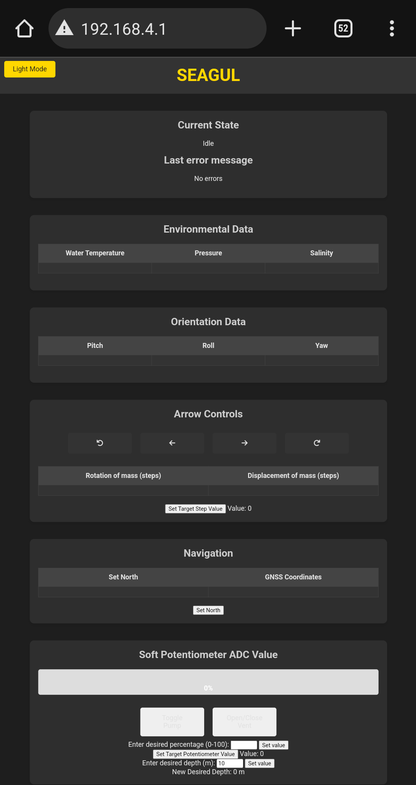
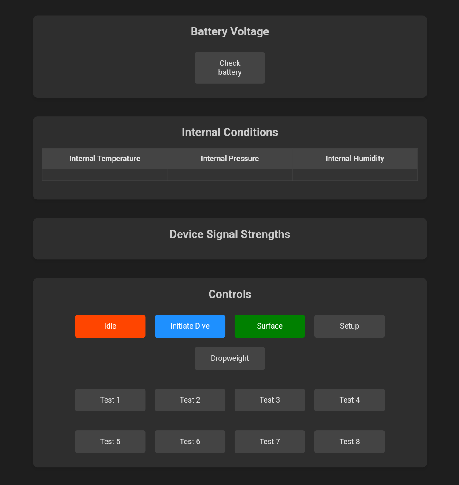

# Instructions
The following page contains instructions which are neccesary for development and use of the glider.
# Programming
## Intro

The code for the glider has been developed with the Arduino programming language through the arduino extension in VScode. The programming encompasses both code for the main micro controller (ESP32-S3) and the Artemis Global Tracker, which together makes the glider function.

Some useful links for programming:
- [Sparkfuns repository for the ATG](https://github.com/sparkfun/SparkFun_Artemis_Global_Tracker), it contains alot of useful examples.

## Programming setup

### Software
For the programming to work for the glider, a few steps are needed. First off you need to be able to have easy access to the github repository, the most simple way to do this is to download the Github Desktop app and follow online instructions to copy the repository toyour computer. From there you can pull changes others have made and push your own contributions. Secondly you will need a code interface, for this you should use VScode. From github desktop you will be able to link your VScode to sync your changes. 

### VScode
Your VScode will need some work before functioning properly.

1. In the extensions manager, download the Arduino extension.

2. Follow [online instruction](https://dev.to/gamegods3/how-to-install-gcc-in-windows-10-the-easier-way-422j) to download the g++/gcc compiler. 

3. Open one of the larger files eg. *glider_monterat_test3*. All of the **#includes** will be marked red, this is due to missing libraries. Click *ctrl-shift-p* and find the arduino library manager. From there you will be able to start downloading libraries which include the different header files. Some of the libraries can be hard to find, but shouldnt be more than a google search away. These libraries will probalby endup in *C:\Users\<YourUsername>\Documents\Arduino\libraries*

4. Now you will need to download the right board setups. go to ctrl-shift-p and search for **ESP32** and add that. Next do the same for the **SparkFun Apollo3 Boards**. Now you will be able to find the correct boards in the bottom right corner of VS code (**ESP32S3 Dev module** and **RedBoard Artemis ATP**).

### Using the boards
Before uploading code to the microcontrollers you will also need to go though some steps.

#### ESP32S3

1. Plugg in the microcontroller with a micro-usb cable using the 'UART' port. 
2. Change the **COM** port in VScode in the bottom right corner. VScode should only show you one option (eg. **COM4**). 
3. Change the board type to **ESP32S3 Dev Module**.

4. Change the programmer to **Esptool**

5. **Verify** the code in the top right corner. If any issues appear, resolve these (see troubleshooting section furhter down). 

6. If verified correcly hold down the **boot button** on the ESP32 and uppload using the **uppload button** in VScode. When this text appears, **release** the boot button:
> Sketch uses 1037061 bytes (79%) of program storage space. Maximum is 1310720 bytes.
Global variables use 44136 bytes (13%) of dynamic memory, leaving 283544 bytes for local variables. Maximum is 327680 bytes.
>

#### Artemis Global Tracker, AGT

1. Plugg in the microcontroller with a usb-c cable.

2. Change the **COM** port in VScode in the bottom right corner. VScode should only show you one option (eg. **COM4**). 

3. Change the board type to **RedBoard Artemis ATP (SparkFun Apollo3 Boards)**.

4. In the Board Configuration change the Baud Rate to **921600** and make sure the uploader in SparkFun Variable Loader. 

5. Change the programmer to **Ambiq secure bootloader**

6. **Verify** the code in the top right corner. If any issues appear, resolve these (see troubleshooting section). 

6. If verified correcly begin the upload. 

## Trouble shooting
With the setup complete there will still unavoidably be some issues, there are some known issues and some which will be unique to your computer and its setup.

### Known issues
For the ESP32 to work properly it may be neccessary to add **USBCON** and **ARDUINO=10812** to the *c_cpp_properies* file under *defines*, for more context see the code block below.

### Standard trouble shooting
The most common issue is pathing to the libraries in VScode. You may need to include the libraries manually or change the directories yourself. The added libraries can as previously mentioned be found in *C:\Users\<YourUsername>\Documents\Arduino\libraries* and the standard libraries should be found in *C:\Users\<YourUsername>\AppData\Local\Arduino15*. In these directories you should be able to find the header files which are missing and manually add them to the force include. 

### c_cpp_properties.json
This file will be created the first time you compile a sketch adn create an intellisense configuration. It is here you change searched directories and other preferences. Bellow follows a snippet of an example **c_cpp_properies** that has had some troubleshooting steps. Your file shouldn't necesarilly look like this, this is just an example of how it could look after some manipulation:

    {
    "version": 4,
    "configurations": [
        {
            "name": "Win32",
            "compilerPath": "C:/MinGW/bin/gcc.exe",
            "compilerArgs": [],
            "intelliSenseMode": "gcc-x64",
            "includePath": [
                "${workspaceFolder}/**",
                "C:/Users/oskar/AppData/Local/Arduino15/packages/esp32/**",
                "C:/Users/oskar/AppData/Local/Arduino15/packages/arduino/**",
                "C:/Users/oskar/AppData/Local/Arduino15/packages/sparkfun/**",
                "C:/Users/oskar/AppData/Local/Arduino15/packages/SparkFun/hardware/apollo3/2.2.1/cores/arduino/mbed-bridge/core-api/api/deprecated-avr-comp/avr/**",
                "C:/Users/oskar/AppData/Local/Arduino15/**",
                "C:/Users/oskar/Documents/Arduino/libraries **"
            ],
            "browse": {
                "path": [
                    "${workspaceFolder}",
                    "C:/Users/oskar/Documents/Arduino/libraries/**",
                    "C:/Users/oskar/AppData/Local/Arduino15/packages/esp32/**",
                    "C:/Users/oskar/AppData/Local/Arduino15/packages/arduino/**",
                    "C:/Users/oskar/AppData/Local/Arduino15/packages/sparkfun/**",
                    "C:/Users/oskar/AppData/Local/Arduino15/**"
                ],
                "limitSymbolsToIncludedHeaders": true,
                "databaseFilename": ""
            },
                
                
            
            "forcedInclude": [
                "C:/Users/oskar/AppData/Local/Arduino15/packages/esp32/hardware/esp32/3.0.3/libraries/Wire/src/Wire.h",
                "C:/Users/oskar/AppData/Local/Arduino15/packages/esp32/tools/esp-rv32/2302/lib/gcc/riscv32-esp-elf/12.2.0/include-fixed/limits.h"
            ],
            "cStandard": "c17",
            "cppStandard": "gnu++17",
            "defines": [
                "USBCON",
                "_DEBUG",
                "UNICODE",
                "_UNICODE",
                "ARDUINO=10812"
            ]
        },
## WiFi

To the right you can see the webpage which is used to controll the glider when it is at the surface.

 The website showcases sensor values, potentiometer value, ballast possition and allows the glider to enter some states. 

The Webpage is also useful when testing the glider in the lab, as you can make sure that the proper values are being read and all of the glider can be controlled. 

When starting the glider the ESP32 will sit in the init state. Before you are able to controll annything you have to enter the IDLE case with the button near the bottom of the webpage. You can always make sure that the right case is entered by the 'error message' and 'Current state' at the top of the page.

***Error message doesn't indicate and issue, it is merely the latest message sent from the ESP32.***

Before initiating a dive, make sure that you have set a target possition for both the potentiometer and the steppermotors. You also have to set a desired depth. 

It is important to note that the Wifi signal dissapears as soon as more the half the glider is submerged. 

To reach the website you need to connect to the Seagul network, which is available as soon as the ESP32 is running.
The password is **0123456789**. When connected, open a browser and enter **192.168.4.1** in the search field.
 

## Electronics

## Useful knowledge
Bellow follows some important general knowledge about the glider.

- The steppermotors can be configured for microstepping (see 2. Electronics). In the gliders current state the microstepping is set to 1/16 which allows for smooth motion and precise movement. When utilising the max range on the translaitonal movement, the values therefore go from 0 - 6200\*16 = 0 - 92000 steps. The rotaitional motors go \+/\- 250\*16 steps.

- The value for the fullness of the oil reservoir on the webpage doesnt display the fullness in percent, but rather the potentiometers min and max value as a percentage. At the moment the external bladder is empty at ~2600 and empty at ~1700. 

- When controlling the glider from the webpage before start, several things are needed. Always start with putting the glider in **idle**. Make sure to **set a target value** for both the potentiometer and the translational motor. Make sure to set a **max depth** for the glider. 

