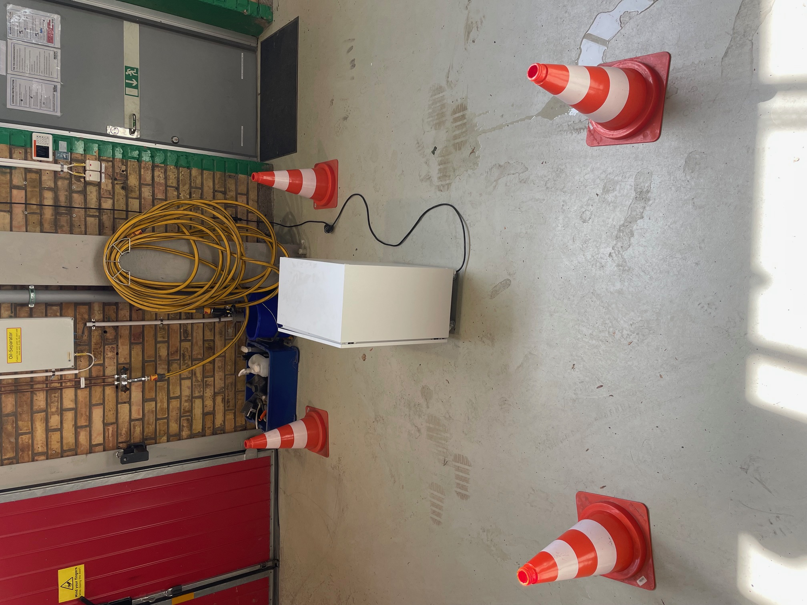
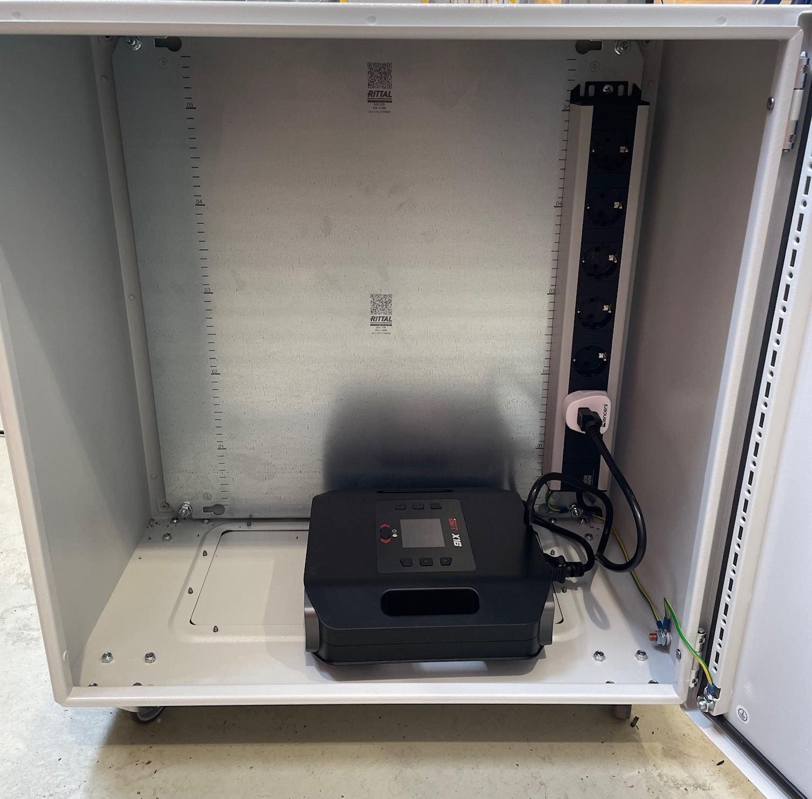
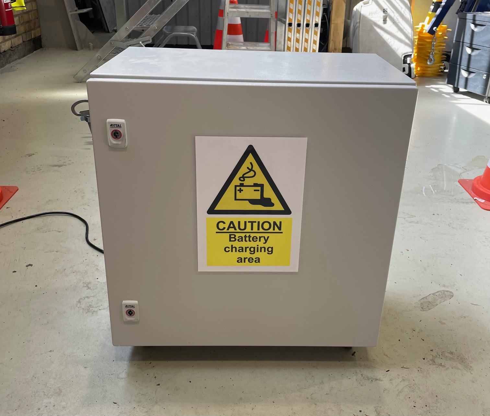
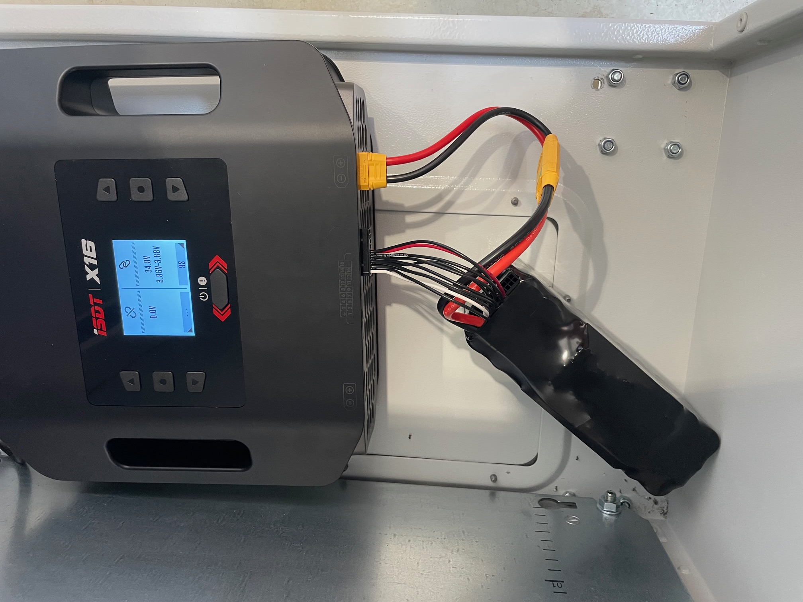
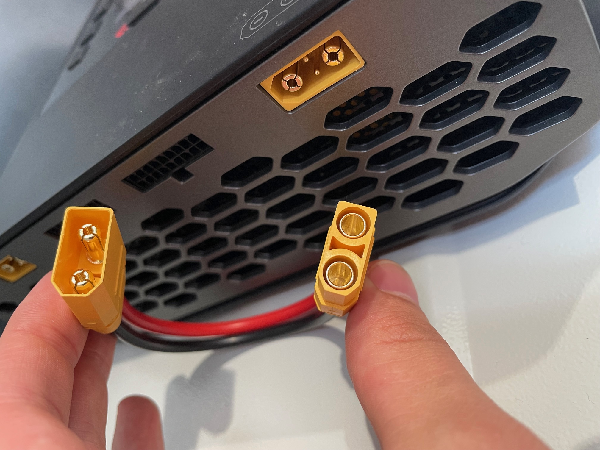
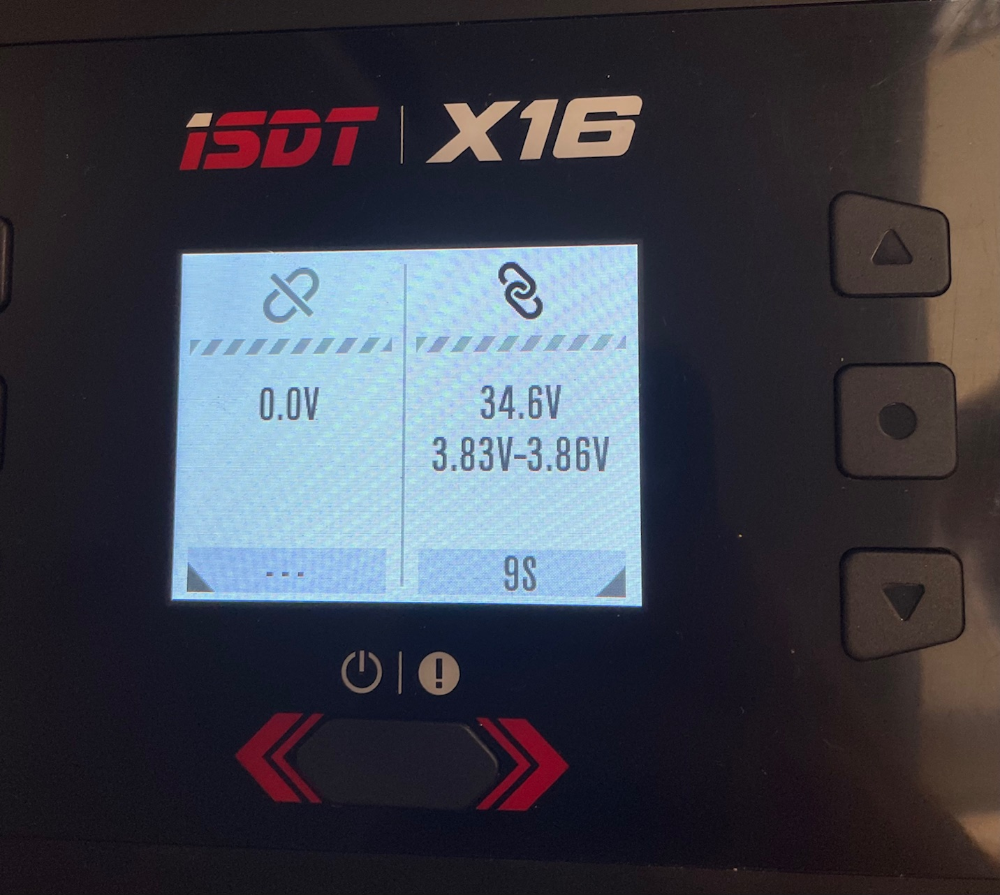
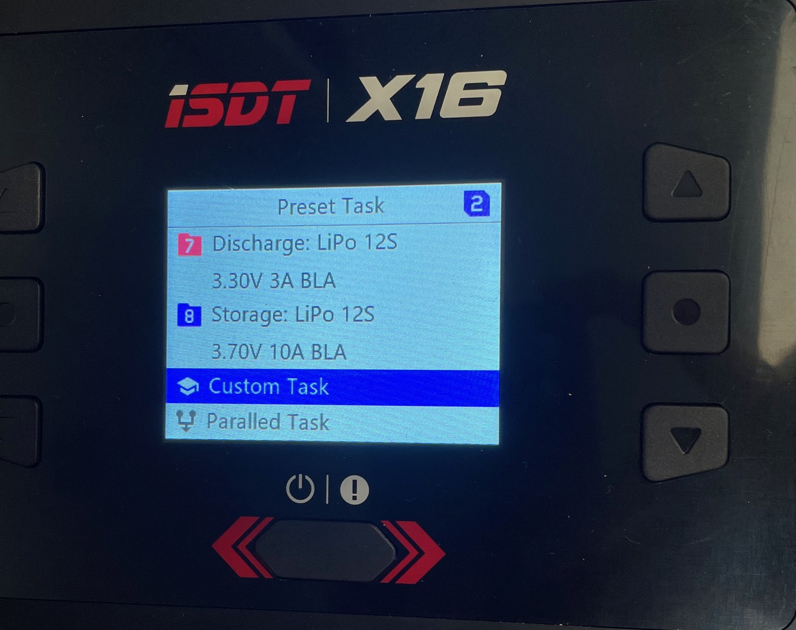
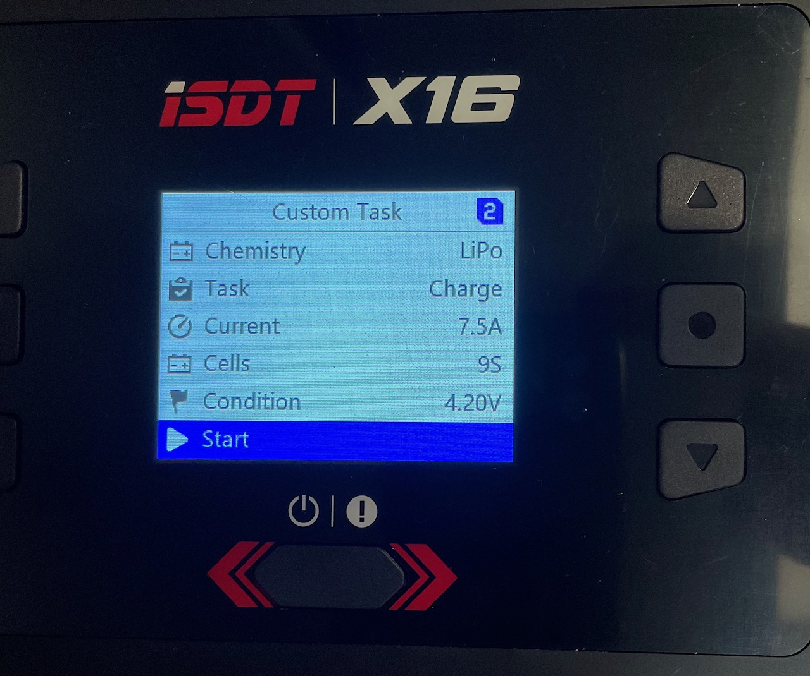
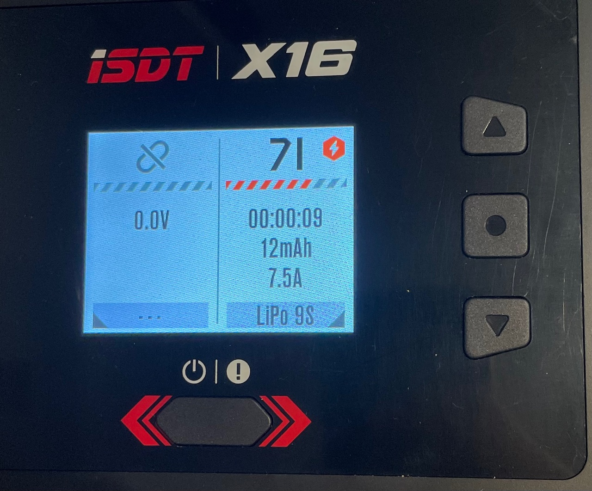
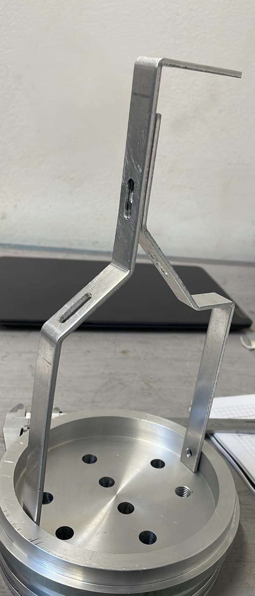

# Instructions for further development

## Programming

## Batteries

The batteries are bought from MaxAmps and are Lithium Ion 9S 32,4 V battery packs. For more information read on their product page:
https://maxamps.com/collections/9s-32-4v-li-ion/products/li-ion-10350-9s3p-32-4v-battery-pack

### Charging routines

Li-ion batteries needs to be handled with care and caution since battery fires can be extremely problematic and dangerous. It is therefore very important to follow safe procedures when it comes to charging. 

Firstly, the area used when charging should have easy access to the outdoors so that the cabinet can easily be moved outside in case of fire or other emergency. It is also extremely important that the charging area does not block any emergency exits. A good example of area for charging is close to the big gate in Revere (make sure to unlock the doors and place cones before starting). 
 

Charging should always take place in the designated cabinet. 

Connect the charger to the outlet inside the cabinet. And turn it on by pressing the power button.
 

Connect the battery to the charger by first plugging in the balancing lead. The xt90 cable from the battery does not fit directly into the charger since the charger outlet has two extra pins (xt90i). Since the extra pins aren't necessarily needed, we can use an adapter cable as shown in the picture to the left. The manufacturer, MaxAmps, has confirmed that this is ok to do.
 

Once the battery is correctly connected to the charger, you should be able to see the voltage status of the battery and the different cells. 

In order to start charging: 

- Press and hold the circle-button (the one between up and down arrows)
- Scroll down and press "Custom Task"
- Chemistry: LiPo (this is ok since Li-ion can handle more voltage than LiPo)
- Task: Charge
- Current: ~7.5 A (it is recommended to use 0.5C - 1C while charging. 10.35 A corresponds to 1C and would take one hour to fully charge the battery)
- Cells: 9S
- Condition: 4.20 V
- Press "Start"

**Always keep the battery attended during charging. If the battery becomes abnormally hot, stop charging immediately and place the cabinet outside.**

In order to stop charging:

- Press and hold the circle-button
- Press "Stop"
- Turn off the charger by holding the power button
- Disconnect battery cables

 

## WiFi

## CAD

## Electronics

## Hardware

In 2024, a large part of the mechanical construction and hardware was carried out in collaboration with Pelle Evensen and Henrik Hörlin at FUSE, Chalmers. 

### Rear lid (svarv, genomföringar, radiella hål, skruvar)

A cylinder in aluminum with 150 mm diameter was turned to desired design.
Eight different penetrations were made in the rear lid by first drilling with a 9,8 mm drill. Next, one of the holes was threaded to 7/16 inch to fit a SubConn bulkhead of the same dimensions while the remaining penetrations were reamed up to 10 mm to fit M10 screws.
The penetrations in the rear lid are used for the following purposes:

1. Temperature sensor (M10)
2. Pressure sensor (M10)
3. Salinity sensor (M10)
4. Vacuum valve (M10)
5. Thruster (M10)
6. Antenna (M10)
7. Dropweight (7/16” 20 UNF)
8. On/Off switch (M10)

 

In addition, radial holes were drilled in the lid. With 45 degrees of separation, seven M5 holes and one M6 hole were drilled and threaded. A ninth radial hole was also drilled and threaded into M6, to mount the sacrificial anode. The radial holes were distributed using a dividing head at Microfabriken.

### Pump module (främre lock, aluminiumskivor, bälg, blåsa, pump, ventil)

### Aluminum rack (plåt bockning, skruvar)

Mounted on the rear lid is an aluminum rack that holds the antenna, the thruster and the magnet for the dropweight. The rack is made by cutting out 3 mm thick aluminum sheet to 15 mm wide strips and then bending to the desired shape. The holes in the rack are drilled to fit M5 screws.
 
### Electronic mounting plates (vattenjet, bockning, blästring)

To mount electronics inside the glider, mounting plates were created in 2 mm thick aluminum sheet. They were cut out with a water jet at FUSE and then sandblasted to achieve a nice surface. Finally a sheet metal bending machine was used to bend the mounting plates.

The PCBs are not directly mounted on the aluminum plates but are instead placed on acrylic mounting plates. These have been cut out with a laser at CASE.

### Manouvre module (Vikter, stegmotorer, CAD)

### Battery module (Vikter, ballast)

The battery module was designed to accommodate space for one battery as well as space for ballast. On the sides, 12 steel rectangular blocks can be clamped, each weighing about 300 g. Furthermore, there are two steel plates with dimensions of 170x60x3 mm, weighing about 235 g each, which can be placed under the battery for additional ballast. 

### Antenna (Gjutning)

### Dropweight (Magnet gjutning + målad, vikter, zinc)

The dropweight system consists of an electropermanent magnet that holds a cylindrical weight. To waterproof the electrical contacts between SubConn and the magnet, heat shrink tubing was first used around the wires. Next, a molding socket was used to mold the cable to the SubConn connector with epoxy. The magnet, in turn, was also molded in epoxy to be waterproof. On the magnetic surface, a very thin layer of epoxy was used to try to obtain as strong magnetic strength as possible. The magnet was later spray-painted black and lacquered for both aesthetic reasons and to have a slightly more durable surface. 

The actual dropweights are steel cylinders with 50 mm diameter. To prevent corrosion, the weights were treated with zinc spray, which acts as a sacrificial anode.

