# Assembling the glider

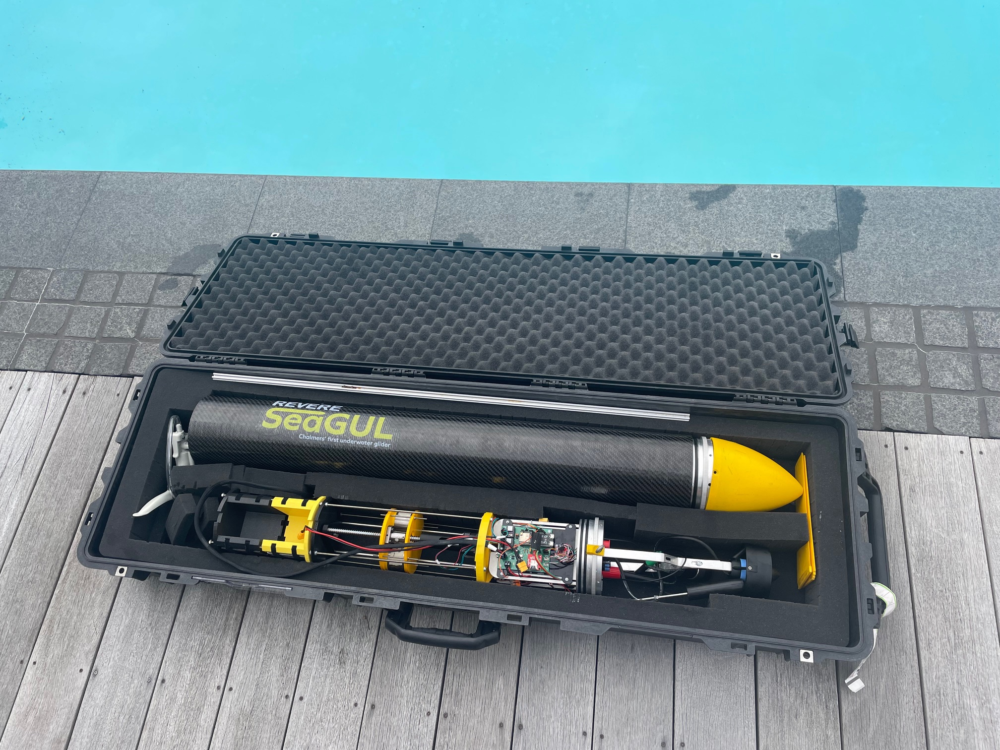

When assembling the glider there are several details that are important to be aware of. This file, consisting of images and text, provides a step by step tutorial on how to correctly assemble the glider before use in water. Beware that the procedures can change depending on what changes have been made to the glider since this manual was written.
 

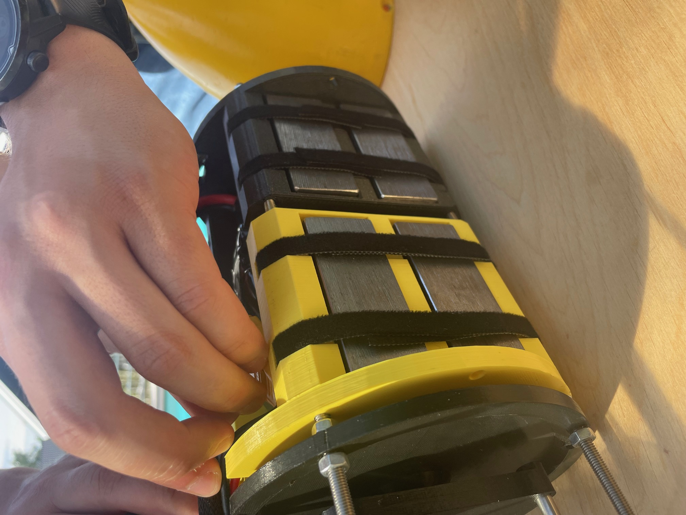

Place the battery in the battery-holder and make sure that the holder is properly ballasted. For example, you might need steel plates under the battery for extra weight. Connect the battery to xt90 cable running across the module.
 

Move the weight package by twisting the ball screw manually. Make sure that the weight package aligns with the end of the black cylinder as illustrated in the picture to the right. This will be position 0 for the translatational stepper motor and you will not be able to move the weights further back than this position during dives. 
 

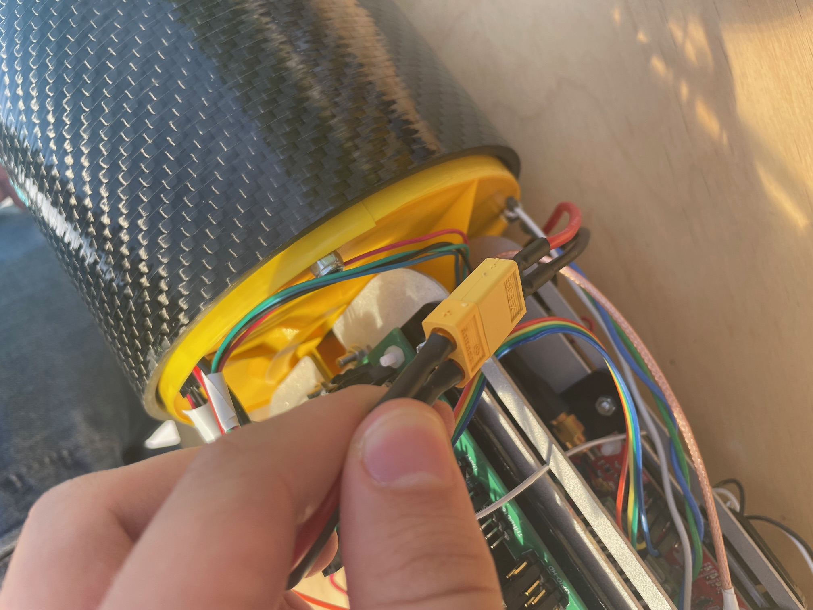
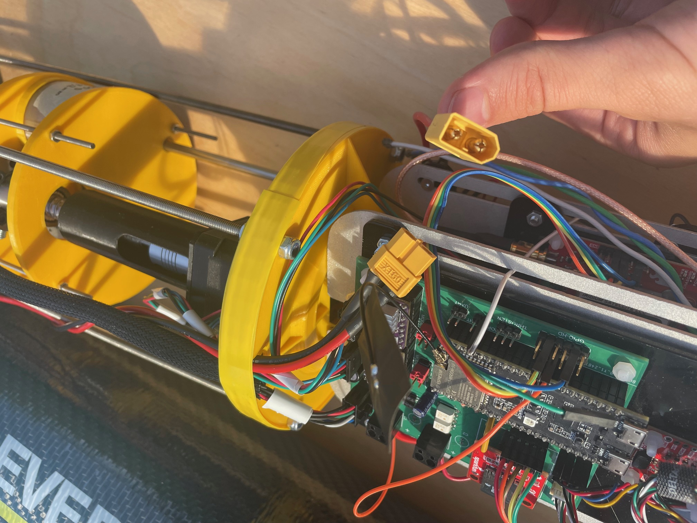

Now you can start carefully sliding in the module in the carbon fibre tube. Make sure not to damage the tube or get any cables stuck.

Connect the battery cable to the electronics.
 

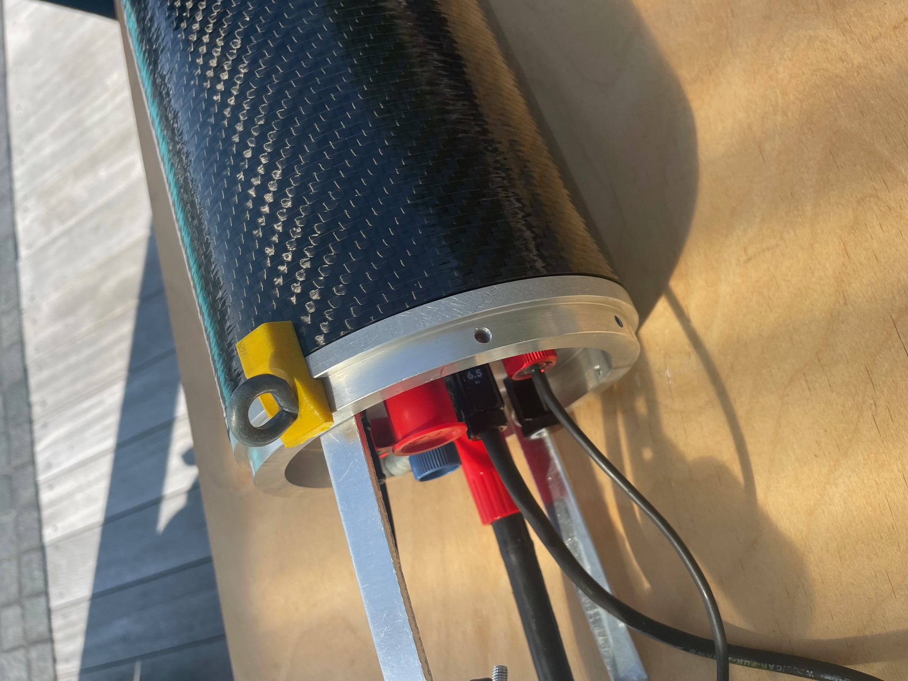

Make sure that the o-rings are properly greased before fully closing the lid. We use Molykote compound 111 that works fine but it might be a good idea to change to compound 55 which is specifically for o-rings since it makes them swell and improves watertightness (they use this at VOTO). 

Damaged or dry o-rings can compromise the watertightness of the glider, especially at higher pressure.
 

Turn on the electronics by screwing in the power switch from the outside of the rear lid. If you do it before closing the lid, you can press the "reset" button on the ESP32 in order to make sure that the code will be running from the beginning. This is optional since the code should work fine without this step. If you don't decide to press reset on the ESP32 it might be preferable to turn on the power after both lids have been closed.
 

There is a long cable from the electronics that goes through the entire glider, connect this to the pump module.
 

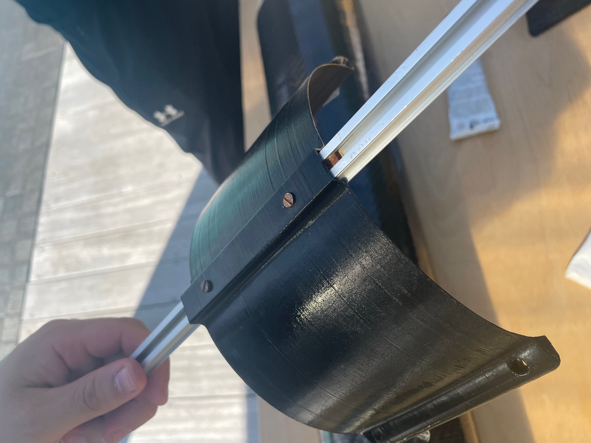

Before inserting the pump module in the tube, make sure that the rail is properly prepared in order to attach the wings later.
 

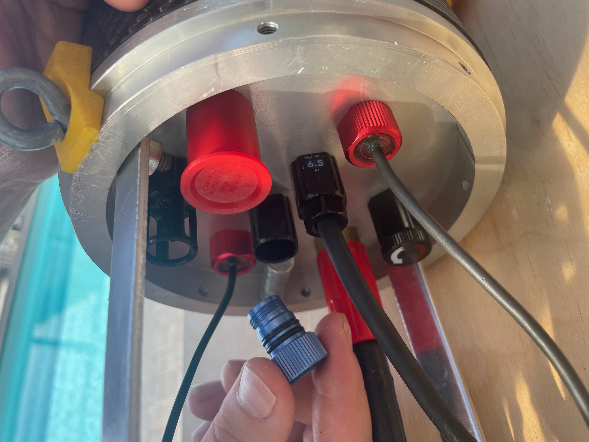
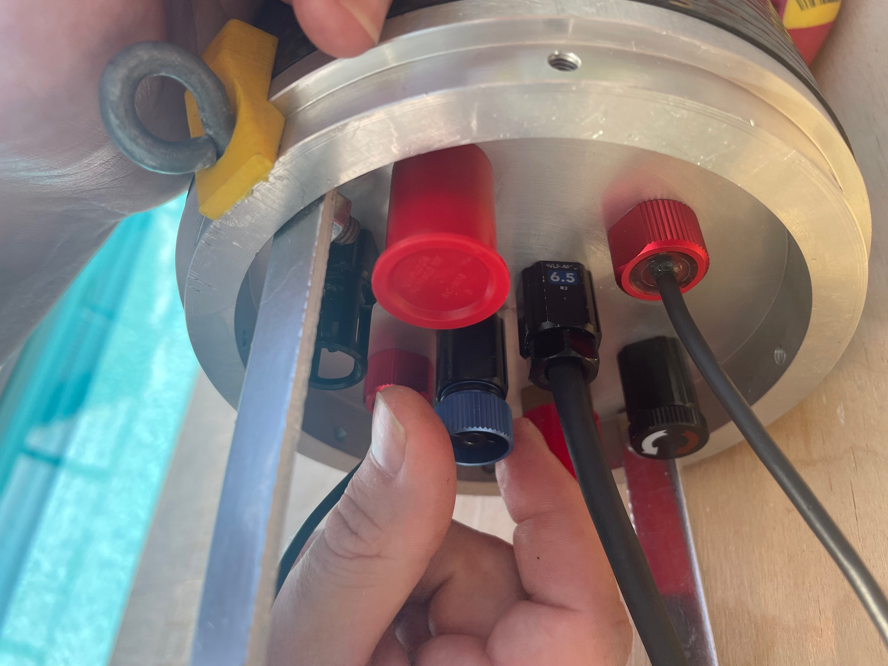

Also make sure to release the pressure valve in the rear lid before inserting the pump module.
 

While inserting the pump module it is important that the rail is aligned. You might need to unscrew the "rail-holder" on the front lid before closing it. 
 

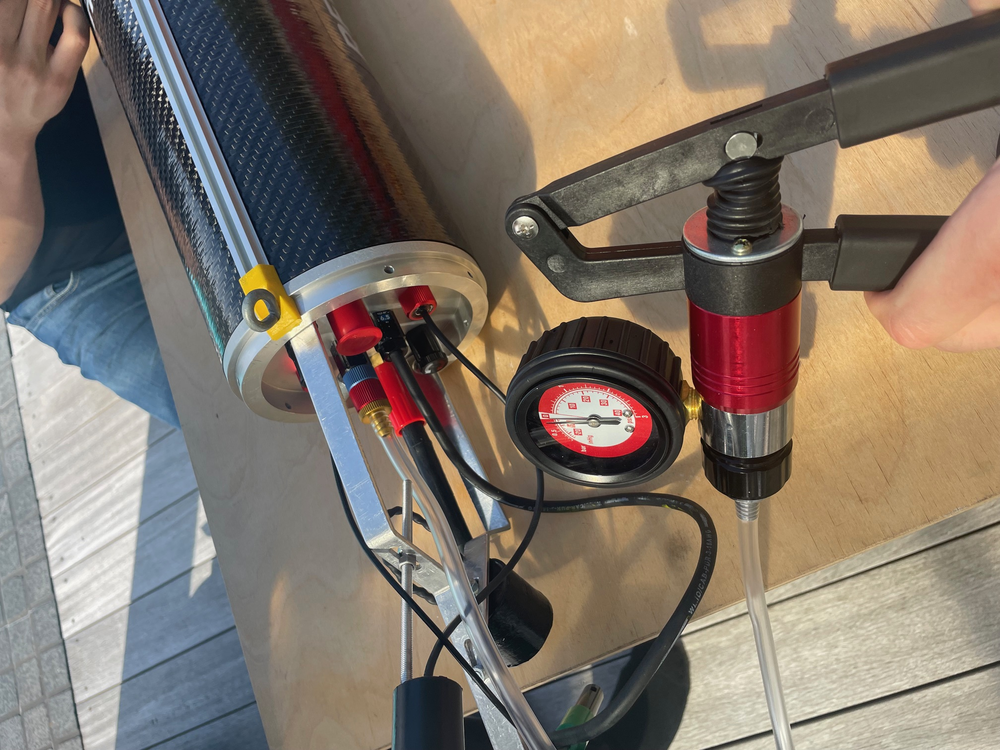

Vacuum pump until 0.7 bar in the glider is reached. This corresponds to 0.3 bar negative pressure (in the picture it is pumped to 0.35 bar negative pressure because the pointer does not start exactly at 0). When unscrewing the vacuum pump be careful that the blue pressure valve stays still and that the red part is fully unscrewed before removed. Otherwise you might release parts of the vacuum and have to start over. The process of pumping takes approximately 12 minutes.
 

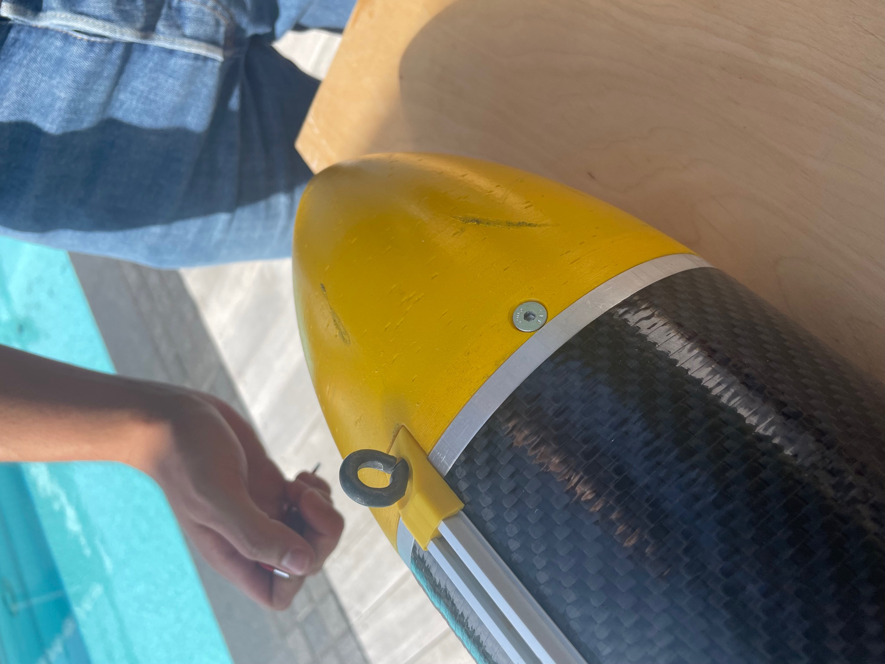
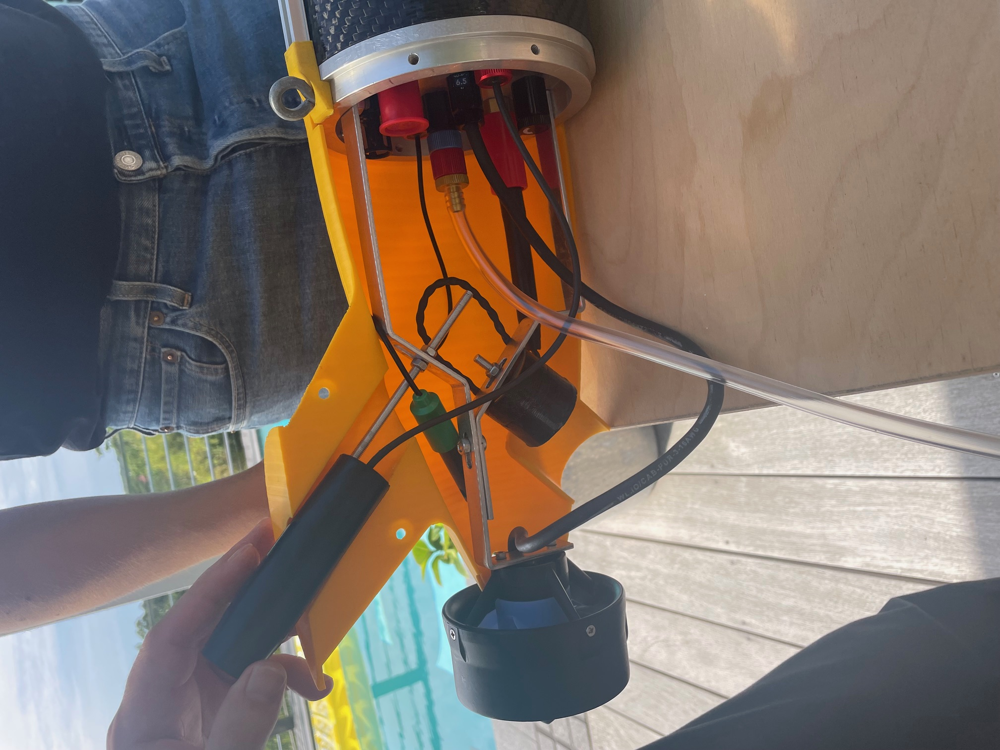

Now it is time to mount the front and rear caps. If available, always use aluminium screws if they are going to be in contact with water. If two different types of metals are in contact under water (especially salt water) there will be corrosion and the materials will deteriorate.

Remember to remove the protective cap from the pressure sensor and make sure that there are sacrificial anodes on both front and rear lids.
 

Mount the wings by clamping them between the black "wing holders" connected to the rail. It is a good idea to leave this step until last as the wings reduces mobility of the glider.
 

Now the glider is fully assembled and it is ready to be thrown in the water!
 

