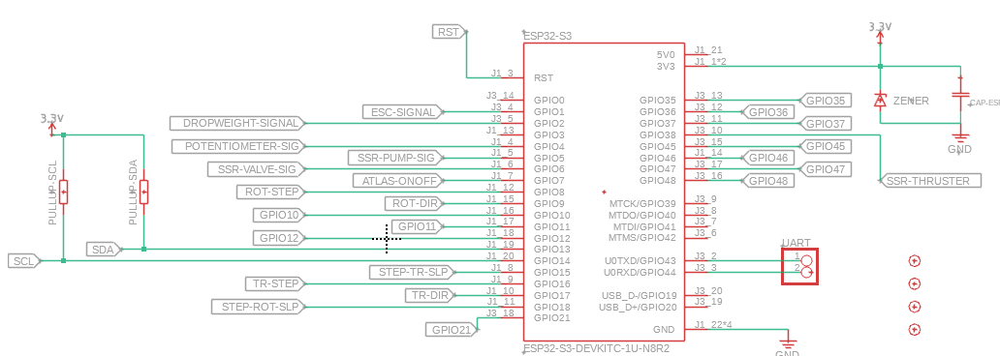
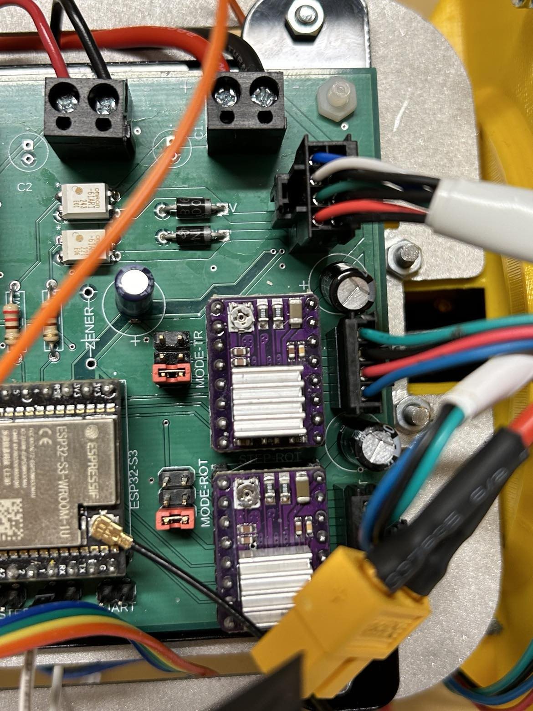

# Electronics

## Overview

he electronic system is divided into three custom-designed circuit boards, as well as several sensors and devices connected to them. The circuit boards are categorized as the "Control PCB," "Power PCB," and "Dropweight PCB." The Control PCB houses the microcontroller, SD card writer, stepper motor drivers, Solid State Relays (SSR) for the pump module, and a series of connectors for connecting the various system components. The Power PCB contains the DC-DC converters and outputs 24V, 3.3V, and 12V voltages. It also includes a voltage divider for measuring battery voltage. The Dropweight PCB technically didn’t need to be a separate circuit board, but it was created to simplify the development of the circuit boards and expedite the completion of the other boards without a finalized dropweight circuit design. The Dropweight PCB controls the electro-permanent magnet through either a signal or a voltage drop in the 3.3V line. The different PCBs and their functionality will be described below. The electronics designs have all been developed using Autodesk Fusion, and the files can be found in the *Electronic files* folder, possibly containing minor changes from the versions that were ordered and implemented in the glider.

## Control PCB

In this section, the control PCB will be presented and explained, hopefully to necessary extent for future improvements and user purposes. Below is an image of the control PCB taken from Autodesk Fusion.

And the schematic design, also from fusion, below.

Finally we have an image of the control PCB mounted in the electronics bay with all the cable connections, taken shortly after the first water test at Voice of The Ocean (VOTO) with the new system. The USB cable is connected to the ESP32, but otherwise this setup is the same as when the glider is up and running.

### Microcontroller

The control PCB houses an ESP32-S3-DevkitC-N8R8, placed in pin header receptables for easy replacement, that functions as the brain of the system. In addition to communicating with all of the sensors and controlling motors, pump and so on, it also communicates with the Atlas Global Tracker (AGT) module. The AGT handles GPS and satellite communication for the glider, and communicates with the ESP via a Serial (UART) connection. The pinout on the ESP can be seen in the figure below.

Some pins have specific names, and names for their headers, but many of them can be modified to be used for different functions. For example, the UART port can be configured and used as GPIO pins instead. Some other pins are directly traced to PCB mounted components, and not to pin headers, and thus their use can not be modified. An example of this would be the pins used for controlling the SSRs to the pump module. If any modification is to be done, it is advicable to follow the traces on the board in an EDA software, or in the images of this github manual, and make sure that it works as intended.

### GPIO header and other designated pin headers

There are som pins simply drawn out to pin headers on the circuit board, some which are designated for certain purposes and some unused. The GPIO header pinout can be seen in the image below

where the connections for the thruster, dropweight and UART are also found. The numbers refer to the specific GPIO pin number from the ESP32. Unnamed pins in the image are simply not routed and can be ignored. The UART pins are unused as of now, but could connect to a UART device or be used as GPIO pins. The dropweight header has a signal pin, GPIO2, for the ESP32 to trigger the dropweight system, and also a 3V3 pin which can be used if the dropweight circuit is configured to be able to release the weight in the event of power failure. More on that in the description of the dropweight circuit.

Out of the general GPIO pin header, some are used for specific purposes listed below:

- **GPIO10** is used to read battery voltage, and this needs to be done from an ADC capable pin (preferrably ADC1 since ADC2 can be limited)

- **GPIO11** is sintended to be used to enable the voltage divider for reading VBAT, but is not implemented right now as one of the tranistors used in that circuitry did not work with 3.3V (Explained more in the *power PCB* section) and thus it is unused currently

- **GPIO12** is intended to be used for the SOS leak sensor, but not currently tested and implemented.

- **GPIO35 & 36** are used as Serial (UART) pins in communication between the ESP32 and the Atlas Global Tracker. 35 (TX) is connected to SCK on the AGT, and 36 (RX) is connected to CIPO on the AGT. Note that RX on one device goes to TX on the other device.

- **GPIO45** is connected to the AGT AD35 pin and is used to "poke" the AGT, in order to wake it up and establish communication between the microcontrollers

- **GPIO48** is connected to the AGT D4 pin and is used to recieve a "poke" from the AGT, in the same purpose as for GPIO45.

### Stepper motor drivers

In order to drive the two stepper motors that are used in the maneuvering module to move the center of gravity of the glider, there are two DRV8825s mounted to sockets on the circuit board. Sockets are used for simple replacement. These have an adjustable onboard current limit which is set to the limit of approximately 1.2A, as to not overpower the stepper motors. See https://www.pololu.com/product/2133 for more info.

These stepper motor drivers use three pins each from the ESP32; STEP, DIR and SLEEP. Sleep mode is used when the motors are not running in order to minimize energy use.

Furthermore, there are 3x2 pin headers connected to the DRV8825's MODE pins in order to control the microstepping mode. For info on how the microstepping is set, see https://www.pololu.com/product/2133. Simply place pin header jumpers over the pins in order to bridge the 3.3V line to the desired MODE pins on the driver. This can be seen in the image below, where the red jumpers are placed such that both stepper motors are in the 1/16 microstepping mode.

From the view of the picture above, the left columns of the pin headers are connected to the 3.3V line, and the right side columns are connected to the MODE1, MODE2 and MODE3 pins respectively.

Near the input VMOT, which is 24V, to the DRV8825's are 47 $\mu F$ electrolytic capacitor to help reduce voltage spikes and noice, to protect components. And the stepper motors are connected with Molex NANOFIT 1x4 connectors mounted to the circuit board.

### Variable bouyancy engine

The variable bouyancy engine consists of an internal reservoir and an external bladder, between which hydraulic oil flows in order to control the gliders bouyancy to make it dive or float. To move the hydraulic oil to the external bladder, there is a geared micropump from TCS (https://micropumps.co.uk/product/mgd1000p-pk-v/) with it's own control board (EQI-UART), used in a configuration where the pump runs at constant speed set by an on board potentiometer on the pump driver. When the oil is moved to the reservoir instead, there is a solenoid valve (Burkert Solenoid Valve 134084) that combined with the internal vacuum of approximately -0.3 bar can transport the oil in from the bladder. In order to check the amount of oil in the reservoir, there is a SoftPot potentiometer mounted to the module as seen in the image of the whole VBS below.

Both the pump and the solenoid valve are controlled from the microcontroller via Omron G3VM 61AR1 solid state relays, with ~180 $\Omega$ current limiting resistors connecting the controlling pins to the SSRs. This mode of controlling pump and valve allows for easy implementation with control only by writing one pin high or low respectively, and builds on earlier work. The EQI UART control board for the pump can be configured for more advanced usage, but for simplicity the system has been kept in the "one speed" configuration.

The connection to the VBS is made through a Molex NANOFIT 2x4 connector mounted to the board, with the physical layout and pins shown below. Note that there is also flyback diodes in place near the pump and valve connections, in order to handle the back-EMF that can occur in inductive loads such as these. They can be of importance to protect the SSRs from sudden voltage spikes from afforementioned back-EMF, especially when switching the pump or valve on and off.

The cable is drawn all the way through the glider from the electronics bay to the pump module, which should be connected before mounted. The cable could be modified if one for some reason wants the pump module to be mounted in the hull before the back aluminium lid containing the electronics bay, but we've found this to be the easier way.

### Power lines on the control PCB

There is not much to be said about the power lines on the control PCB, since it is fairly simple in design. One thing to note is that there is, currently unpopulated, slots for placing additional decoupling capacitors on both the 3.3V line and the 24V line. These leave room for mounting capacitors in case there is unwanted noise, but as of now it has not been found necessary.

 The connections for the power lines can be seen in the image showing the pump connectors in the previous subsection. The power is connected via cables that are mounted in screw terminal blocks on the circuit board, connecting to the power PCB.

 ### Sensors and SD card module

The glider uses a temperature sensor, pressure sensor, electrical conductivity sensor, an SD card module and an IMU to both control the system and save gathered data. Currently they are all connected to the ESP32 via the I2C protocol.

The temperature sensor is a Blue Robotics Celsius-Fast-Response, and the pressure sensor is a Bar100 also from Blue Robotics. Both of these are connected directly to the board via JST GH 1x4 connectors in order to be compatible with the original cables for the sensors. This makes for easy integration without modifying cables, and also makes it simple to switch out sensors or use the glider's sensors for other projects if needed.

The SD card module is a SparkFun Qwiic OpenLog, that is mounted on to the board in a socket header, via its soldered-on pins. The sockets once again makes it easier to switch out a faulty model.

The conductivity sensor is an Atlas Scientific Mini Conductivity K1.0 that can read the electrical conductivity, salinity and total dissolved solids (which all are linearly dependent, so it's really just the electrical conductivity that is physically measured and then scaled with proportionality constants). This sensor has it's own controller board, that is mounted in between the two aluminium plates of the electronics bay, and is connected through a pin header.

In the below image we can see the part of the circuit board which houses the OpenLog and the sensor connectors. Note that there is a slot to the right of the conductivity pin header which houses a 0.33A resettable fuse that protects the conductivity sensor as well as the Blue Robotics sensors. The fuse does NOT protect any of the other sensors, or 3.3V circuitry in general.

There are also slots in place for pullup resistors on the I2C clock and data lines (SDA, SCL) but these are currently unpopulated. Typical values of pullup resistors seem to be around 1 - 10 $k \Omega$ but we have not identified a particular need for this. The option remains to solder on resistors here if it would be deemed necessary in the future.

The IMU that is used for the glider is a SEN-15335 from SparkFun, that is connected to one of the two rows of the I2C header that can also be seen in the image above.

It is worth to note that the conductivity sensor also has an option for ON/OFF, in other words a SLEEP mode with lower current draw. However this is not implemented currently, since the sensor is measuring continuously during the gliders operation. If needed, this could simply be connected along with the other connecting jumper cables and in software in order to save energy, as this sensor is probably the one with highest current consumption.

## Power PCB

In this section the power PCB will be explained. This circuit board connects to the battery and via DC-DC converters outputs 24V, 3.3V and 12V. Below you will see the schematic and images of the PCB design, and in the coming subsections the design will be explained in further detail.

The image above shows a 3D rendering snapshot of the full power PCB. Note that by mistake, the mounting holes are not positioned correctly in a square pattern. This should be corrected if any new revisions of the circuit board is developed.

The image above shows the full schematic design of the circuitry, and finally the image below shows 