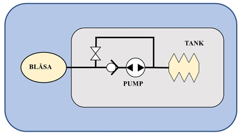
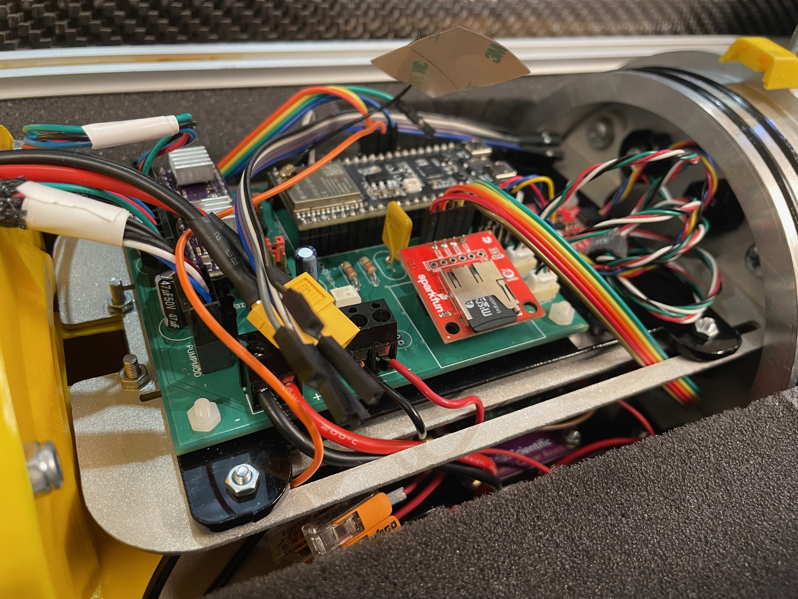
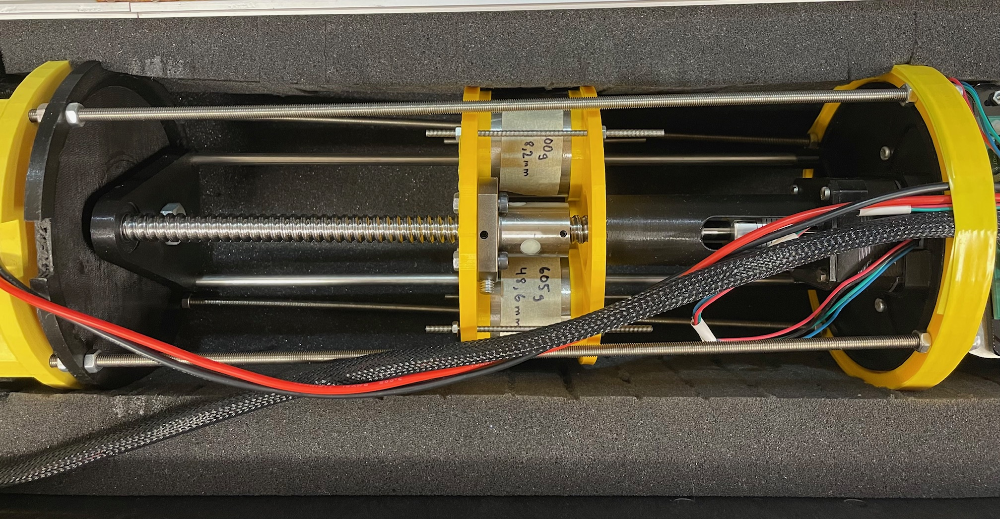
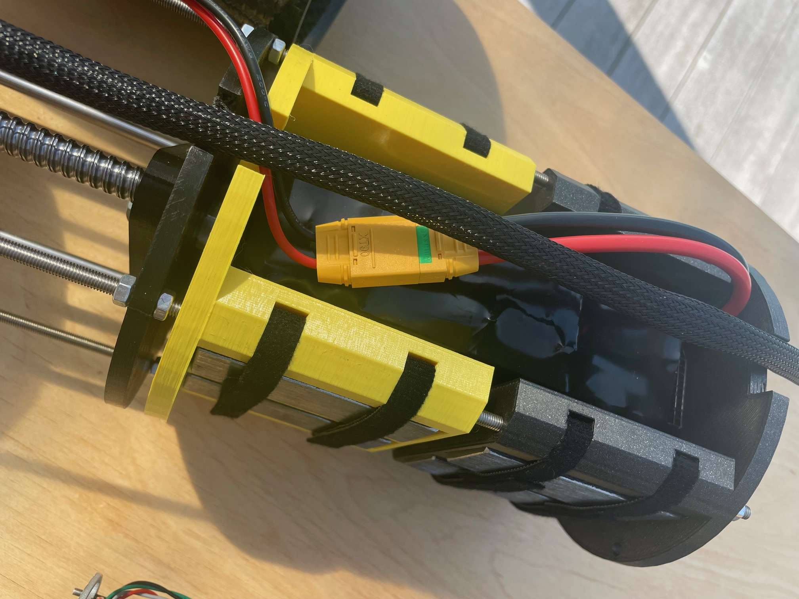
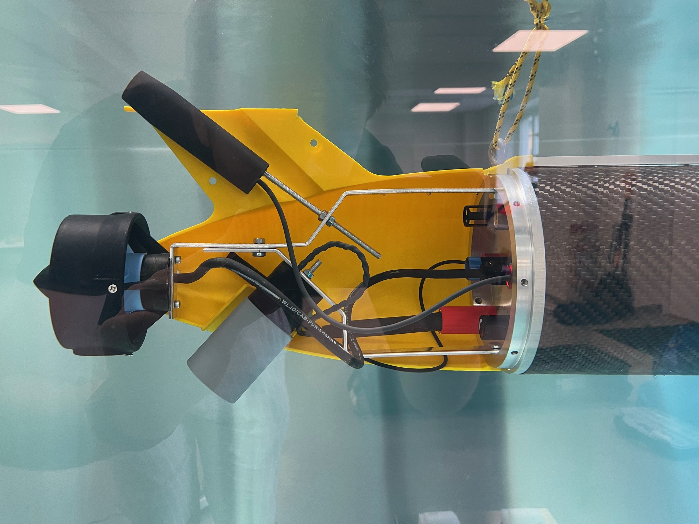

# Hardware

In 2024, a large part of the mechanical construction and hardware was carried out in collaboration with Pelle Evensen and Henrik Hörlin at FUSE, Chalmers. 

## Rear lid

A cylinder in aluminum with 150 mm diameter was turned to desired design.
Eight different penetrations were made in the rear lid by first drilling with a 9,8 mm drill. Next, one of the holes was threaded to 7/16 inch to fit a SubConn bulkhead of the same dimensions while the remaining penetrations were reamed up to 10 mm to fit M10 screws.
The penetrations in the rear lid are used for the following purposes:

1. Temperature sensor (M10)
2. Pressure sensor (M10)
3. Salinity sensor (M10)
4. Vacuum valve (M10)
5. Thruster (M10)
6. Antenna (M10)
7. Dropweight (7/16” 20 UNF)
8. On/Off switch (M10)

 

In addition, radial holes were drilled in the lid. With 45 degrees of separation, seven M5 holes and one M6 hole were drilled and threaded. A ninth radial hole was also drilled and threaded into M6, to mount the sacrificial anode. The radial holes were distributed using a dividing head at Microfabriken.

## Pump module

The pump module consists of an internal bellow and an external bladder. To change the gliders effective volume, hydraulic oil is being transferred between these two bladders. A pump is used to fill the external bladder through a one-way-valve. The negative pressure in the glider is used in order order for the oil to return to the internal bellow. This is allowed by opening a magnetic valve. A potentiometer is used to monitor the bellows' oil level.

The mechanical construction of the pump module was conducted by the bachelor thesis in 2023. 

The original hydraulic oil used in the pump system had ISO viscosity grade 116 cSt ([rs-online/hydraulic-fluid-116](https://se.rs-online.com/web/p/hydraulic-fluid/2044572?gb=s)). The magnetic valve is only rated for viscosity ≤ 20 cSt so this oil was actually way too thick for the system. Currently the oil being used has ISO viscosity grade 15 cSt which runs much better ([mekster/mpm-hydraulic-oil-15](https://www.mekster.se/mpm-15-hvi-15-842747.html#918=115189)).

 

## Aluminum rack

Mounted on the rear lid is an aluminum rack that holds the antenna, the thruster and the magnet for the dropweight. The rack is made by cutting out 3 mm thick aluminum sheet to 15 mm wide strips and then bending to the desired shape. The holes in the rack are drilled to fit M5 screws.
 

## Electronic mounting plates

To mount electronics inside the glider, mounting plates were created in 2 mm thick aluminum sheet. They were cut out with a water jet at FUSE and then sandblasted to achieve a nice surface. Finally a sheet metal bending machine was used to bend the mounting plates.

The PCBs are not directly mounted on the aluminum plates but are instead placed on acrylic mounting plates. These have been cut out with a laser at CASE.
 

## Maneuvering module

The maneuvering module enables the movement of internal weights in the glider. The weight package consists of three steel cylinders weighing about 600 g each. A ball screw driven by a stepper motor can move the weight in translational direction while another stepper motor can rotate the weight package.
 

## Battery module

The battery module was designed to accommodate space for one battery as well as space for ballast. On the sides, 12 steel rectangular blocks can be clamped, each weighing about 300 g. Furthermore, there are two steel plates with dimensions of 170x60x3 mm, weighing about 235 g each, which can be placed under the battery for additional ballast. 
 

## Antenna

The antenna has combined purpose in that it provides communication via both GPS and Iridium. The antenna was placed in a molding socket together with a threaded aluminium bar and then molded together using epoxy. This ensures that the antenna is waterproof and that it can easily be mounted to the aluminium rack. In order to have a waterproof penetration for the cable through the rear lid, epoxy was once again used to make a potted penetrator.

## Dropweight

The dropweight system consists of an electropermanent magnet that holds a cylindrical weight. To waterproof the electrical contacts between SubConn and the magnet, heat shrink tubing was first used around the wires. Next, a molding socket was used to mold the cable to the SubConn connector with epoxy. The magnet, in turn, was also molded in epoxy to be waterproof. On the magnetic surface, a very thin layer of epoxy was used to try to obtain as strong magnetic strength as possible. The magnet was later spray-painted black and lacquered for both aesthetic reasons and to have a slightly more durable surface. 

The actual dropweights are steel cylinders with 50 mm diameter. To prevent corrosion, the weights were treated with zinc spray, which acts as a sacrificial anode. Note that not all dropweights have been treated since the zinc spray ran out. In the future it might be preferable to electrogalvanize the dropweights instead for improved durability.
 

# CAD

CAD-files can be found under [README.md](/README.md)

3D-printing have mostly been performed at CASE but also to some extent at 3D-labbet in the physics building and at Revere. Every part has so far been printed in PLA but it is strongly recommended to print a new front cap, end cap, wings and holder for the wings in PETG. PLA will deteriorate in saltwater whereas PETG will hold up much better over long periods of time.

