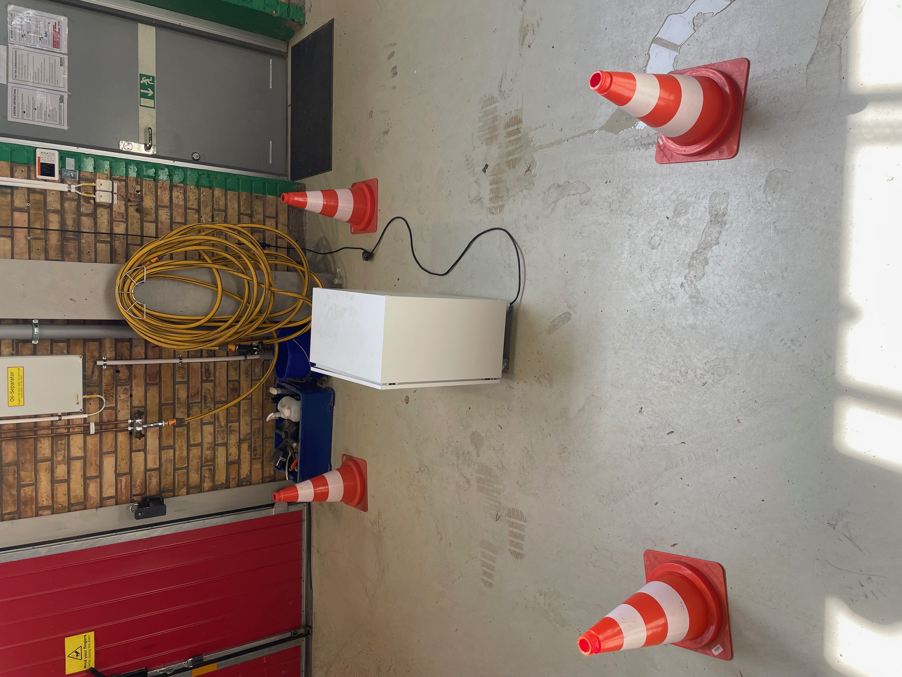
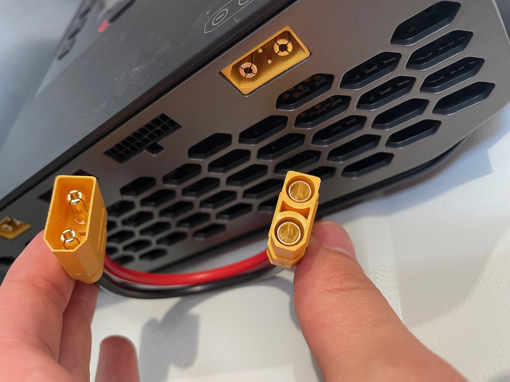
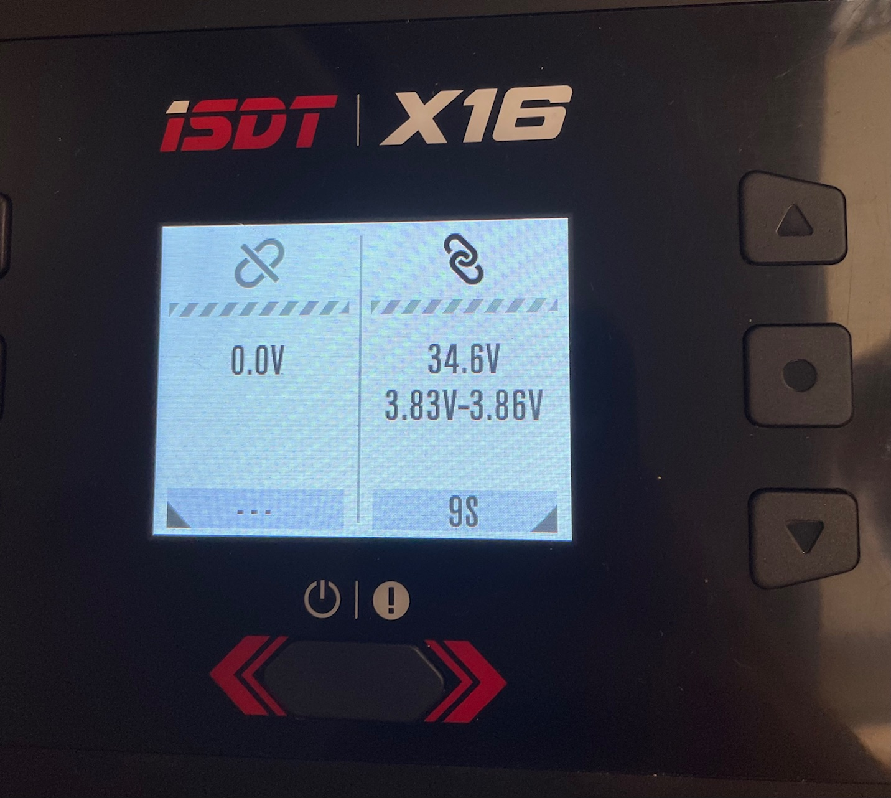
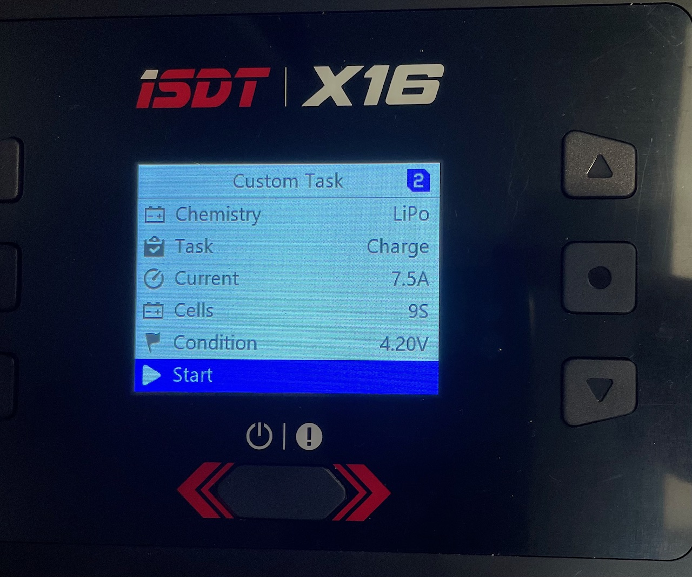

# Batteries

The batteries are bought from MaxAmps and are Lithium Ion 9S 32,4 V battery packs. For more information read on their product page:
https://maxamps.com/collections/9s-32-4v-li-ion/products/li-ion-10350-9s3p-32-4v-battery-pack

## Charging routines

Li-ion batteries needs to be handled with care and caution since battery fires can be extremely problematic and dangerous. It is therefore very important to follow safe procedures when it comes to charging. 

Firstly, the area used when charging should have easy access to the outdoors so that the cabinet can easily be moved outside in case of fire or other emergency. It is also extremely important that the charging area does not block any emergency exits. A good example of area for charging is close to the big gate in Revere (make sure to unlock the doors and place cones before starting). 
 

Charging should always take place in the designated cabinet. 

Connect the charger to the outlet inside the cabinet and turn it on by pressing the power button.
 

Connect the battery to the charger by first plugging in the balancing lead. You may notice that the xt90 antispark connector from the battery does not fit directly into the charger since the outlet has two extra pins (xt90i). The extra pins aren't necessarily needed so we can use an adapter cable as shown in the picture to the left. The manufacturer, MaxAmps, has confirmed that this is ok to do.
 

Once the battery is correctly connected to the charger, you should be able to see the voltage status of the battery and the different cells. 

In order to start charging: 

- Press and hold the circle-button (the one between up and down arrows)
- Scroll down and press "Custom Task"
- Chemistry: LiPo (this is ok since Li-ion can handle more voltage than LiPo)
- Task: Charge
- Current: ~7.5 A (it is recommended to use 0.5C - 1C while charging. 10.35 A corresponds to 1C and would take one hour to fully charge the battery)
- Cells: 9S
- Condition: 4.20 V
- Press "Start"

**Always keep the battery attended during charging. If the battery becomes abnormally hot, stop charging immediately and place the cabinet outside.**

In order to stop charging:

- Press and hold the circle-button
- Press "Stop"
- Turn off the charger by holding the power button
- Disconnect battery cables

 
